## Learning Objectives

+ Be able to describe the difference between R and RStudio
+ Describe the purpose and use of each panel in RStudio IDE
+ Be able to use common R syntax 
+ Describe and use most common data types and data structures in R
+ Demonstrate how to load a library and how to find functions specific to a package 

***

# What is R?

“R” is used to name a programming language and the software that reads and interprets the instructions written on the scripts of this language. Is specialized in statistical computing and graphics. 

The R environment combines:

* effective handling of big data 
* collection of integrated tools
* graphical facilities
* simple and effective programming language

## Why learn R programming?

<figure markdown="span">
  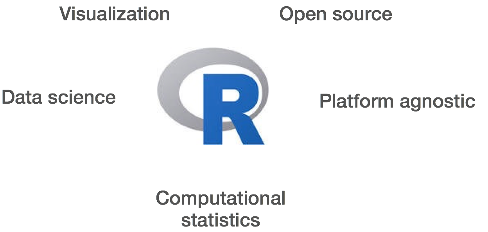{ width="600" }
</figure>

R is a powerful environment. It has a wide range of statistics and general data analysis and visualization capabilities.

* Data handling, wrangling, and storage
* Wide array of statistical methods and graphical techniques available
* Easy to install on any platform and use (and it’s free!)
* Open source with a large and growing community of peers
* R produces high-quality graphics that are reproducible 

#### Example of R used in the media
* *"At the BBC data team, we have developed an R package and an R cookbook to make the process of creating publication-ready graphics in our in-house style..."* - [BBC Visual and Data Journalism cookbook for R graphics](https://bbc.github.io/rcookbook/)


# What is RStudio?

Here, we will use be using R via RStudio. First time users often confuse the two. At its simplest, R is like a car's engine while RStudio is like a car's dashboard as illustrated in the 
Figure below.

<figure markdown="span">
  { width="600" }
</figure>


More precisely, R is a programming language that runs computations, while RStudio is a freely available open-source **integrated development environment (IDE)** that provides an interface by adding many convenient features and tools. So just as the way of having access to a speedometer, rearview mirrors, and a navigation system makes driving much easier, using RStudio's interface makes using R much easier as well. 

> RStudio provides an environment with many features to make using R easier and is a great alternative to working on R in the terminal. 

<figure markdown="span">
  { width="300" }
</figure>

* Graphical user interface, not just a command prompt
* Great learning tool 
* Free for academic use
* Platform agnostic
* Open source


# Creating a new project directory in RStudio

Let's create a new project directory for our "Introduction to R" lesson today. 

1. Open RStudio
2. Go to the `File` menu and select `New Project`.
3. In the `New Project` window, choose `New Directory`. Then, choose `New Project`. Name your new directory `Intro-to-R` and then "Create the project as subdirectory of:" the root of your VACC home account (`~`).
4. Click on `Create Project`.
5. After your project is completed, if the project does not automatically open in RStudio, then go to the `File` menu, select `Open Project`, and choose `Intro-to-R.Rproj`.
6. When RStudio opens, you will see three panels in the window.
7. Go to the `File` menu and select `New File`, and select `R Script`. 
8. Go to the `File` menu and select `Save As...`, type `Intro-to-R.R` and select `Save`

The RStudio interface should now look like the screenshot below.

<figure markdown="span">
  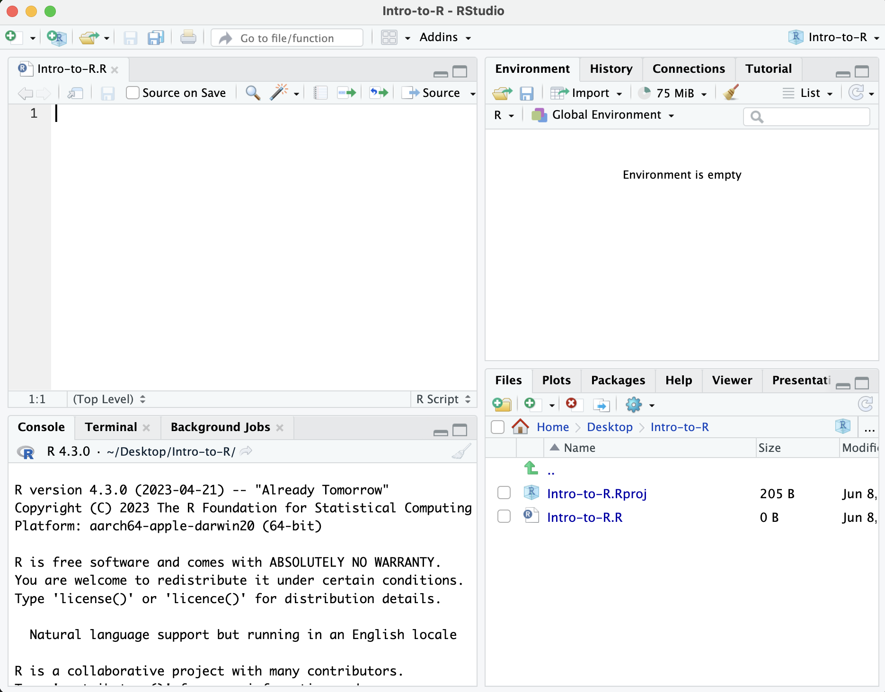{ width="800" }
</figure>

## What is a project in RStudio?

It is simply a directory that contains everything related your analyses for a specific project. RStudio projects are useful when you are working on context- specific analyses and you wish to keep them separate. When creating a project in RStudio you associate it with a working directory of your choice (either an existing one, or a new one). A `. RProj file` is created within that directory and that keeps track of your command history and variables in the environment. The `.RProj file` can be used to open the project in its current state but at a later date.

When a project is **(re) opened** within RStudio the following actions are taken:
 
* A new R session (process) is started
* The .RData file in the project's main directory is loaded, populating the environment with any objects that were present when the project was closed. 
* The .Rhistory file in the project's main directory is loaded into the RStudio History pane (and used for Console Up/Down arrow command history).
* The current working directory is set to the project directory.
* Previously edited source documents are restored into editor tabs
* Other RStudio settings (e.g. active tabs, splitter positions, etc.) are restored to where they were the last time the project was closed.

*Information adapted from [RStudio Support Site](https://support.rstudio.com/hc/en-us/articles/200526207-Using-Projects)*


# Organizing your working directory & setting up

## RStudio Interface

**The RStudio interface has four main panels:**

1. **Console**: where you can type commands and see output. *The console is all you would see if you ran R in the command line without RStudio.*
2. **Script editor**: where you can type out commands and save to file. You can also submit the commands to run in the console.
3. **Environment/History**: environment shows all active objects and history keeps track of all commands run in console
4. **Files/Plots/Packages/Help** is a handy browser for your current files, this is where your plots will appear, you can view package information, and much more.

## Viewing your working directory

Before we organize our working directory, let's check to see where our current working directory is located by typing into the console:

```r
getwd() # return an abolute filepath
# this is also our first example of a function 
```

Your working directory should be the `Intro-to-R` folder constructed when you created the project. The working directory is where RStudio will automatically look for any files you bring in and where it will automatically save any files you create, unless otherwise specified. 

You can visualize your working directory by selecting the `Files` tab from the **Files/Plots/Packages/Help** window. 

<figure markdown="span">
  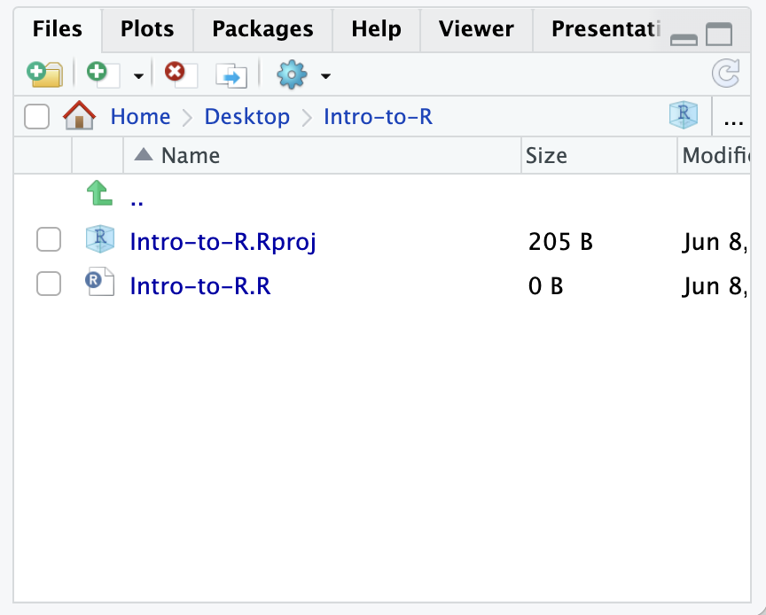{ width="400" }
</figure>

If you wanted to choose a different directory to be your working directory, you could navigate to a different folder in the `Files` tab, then, click on the `More` dropdown menu which appears as a Cog and select `Set As Working Directory`.

<figure markdown="span">
  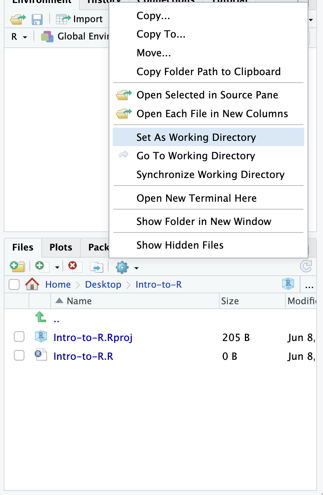{ width="400" }
</figure>

## Structuring your working directory

To organize your working directory for a particular analysis, you should separate the original data (raw data) from intermediate datasets. For instance, you may want to create a `data/` directory within your working directory that stores the raw data, and have a `results/` directory for intermediate datasets and a `figures/` directory for the plots you will generate.

Let's create these three directories within your working directory by clicking on `New Folder` within the `Files` tab. 

When finished, your working directory should look like:

<figure markdown="span">
  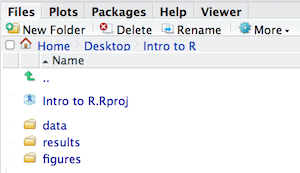{ width="400" }
</figure>

### Setting up 

This is more of a housekeeping task. In the future, we may be writing long lines of code in our script editor and want to make sure that the lines "wrap" and you don't have to scroll back and forth to look at your long line of code.

Click on Code -> Soft Wrap Long lines (make sure this is checked off)

In addition, to avoid character encoding issues between Windows and other operating systems, we are going to set UTF-8 by default:

<figure markdown="span">
  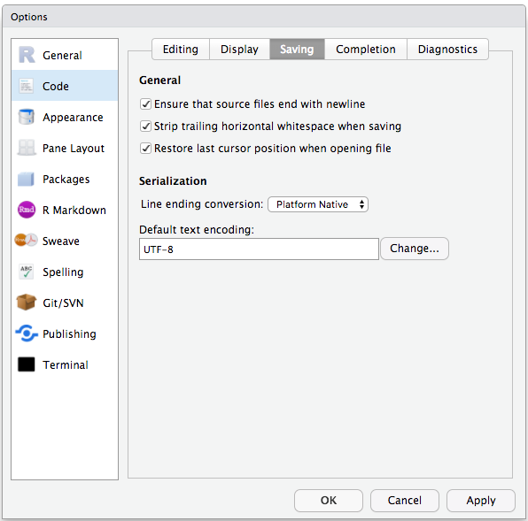{ width="400" }
</figure>

# Interacting with R

Now that we have our interface and directory structure set up, let's start playing with R! There are **two main ways** of interacting with R in RStudio: using the **console** or by using **script editor** (plain text files that contain your code).

## Console window

The **console window** (in RStudio, the bottom left panel) is the place where R is waiting for you to tell it what to do, and where it will show the results of a command.  You can type commands directly into the console, but they will be forgotten when you close the session. 

Let's test it out:

```r
3 + 5
```

> How am I running the line without physically hitting Run? Does anyone know? 

<figure markdown="span">
  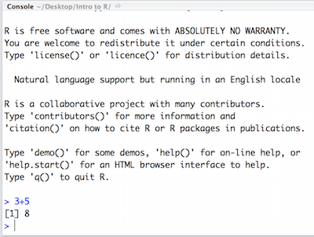{ width="400" }
</figure>


## Script editor

Best practice is to enter the commands in the **script editor**, and save the script. You are encouraged to comment liberally to describe the commands you are running using `#`. This way, you have a complete record of what you did, you can easily show others how you did it and you can do it again later on if needed. 

**The Rstudio script editor allows you to 'send' the current line or the currently highlighted text to the R console by clicking on the `Run` button in the upper-right hand corner of the script editor**. 

Now let's try entering commands to the **script editor** and using the comments character `#` to add descriptions and highlighting the text to run:
	
	# Intro to R Lesson

	# Interacting with R
	
	## I am adding 3 and 5. R is fun!
	3+5


Alternatively, you can run by simply pressing the `Ctrl` and `Return/Enter` keys at the same time as a shortcut.

You should see the command run in the console and output the result.

<figure markdown="span">
  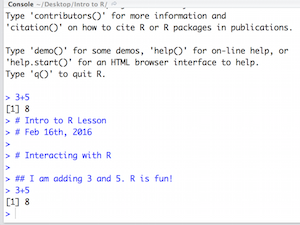{ width="400" }
</figure>

What happens if we do that same command without the comment symbol `#`? Re-run the command after removing the # sign in the front:

```r
I am adding 3 and 5. R is fun!
3+5
```

Now R is trying to run that sentence as a command, and it 
doesn't work. We get an error in the console *"Error: unexpected symbol in "I am" means that the R interpreter did not know what to do with that command."*

***

## Console command prompt

Interpreting the command prompt can help understand when R is ready to accept commands. Below lists the different states of the command prompt and how you can exit a command:

**Console is ready to accept commands**: `>`.

If R is ready to accept commands, the R console shows a `>` prompt. 

When the console receives a command (by directly typing into the console or running from the script editor (`Ctrl-Enter`), R will try to execute it.

After running, the console will show the results and come back with a new `>` prompt to wait for new commands.


**Console is waiting for you to enter more data**: `+`.

If R is still waiting for you to enter more data because it isn't complete yet,
the console will show a `+` prompt. It means that you haven't finished entering
a complete command. Often this can be due to you having not 'closed' a parenthesis or quotation. 

**Escaping a command and getting a new prompt**: `esc`

If you're in Rstudio and you can't figure out why your command isn't running, you can click inside the console window and press `esc` to escape the command and bring back a new prompt `>`.

## Keyboard shortcuts in RStudio

In addition to some of the shortcuts described earlier in this lesson, we have listed a few more that can be helpful as you work in RStudio.

| key              | action                 |
| ---------------- | ---------------------- |
| <kbd>Ctrl</kbd>+<kbd>Enter</kbd>     | Run command from script editor in console with Windows or Linux|
| <kbd>Command</kbd>+<kbd>Enter</kbd>     | Run command from script editor in console with MacOS |
| <kbd>ESC</kbd> | Escape the current command to return to the command prompt          |
| <kbd>Ctrl</kbd>+<kbd>1</kbd>      | Move cursor from console to script editor        |
| <kbd>Ctrl</kbd>+<kbd>2</kbd>     | Move cursor from script editor to console |
| <kbd>Tab</kbd>     | Use this key to complete a file path       |
| <kbd>Ctrl</kbd>+<kbd>Shift</kbd>+<kbd>C</kbd>     | Comment the block of highlighted text               |


!!! example "Class Exercise" 

    Try highlighting only `3 +` from your script editor and running it. Find a way to bring back the command prompt `>` in the console.


# The R syntax

Now that we know how to talk with R via the script editor or the console, we want to use R for something more than adding numbers. To do this, we need to know more about the R syntax. 


The main "parts of speech" in R (syntax) include:

  - the **comments** `#` and how they are used to document function and its content
  - **variables** and **functions**
  - the **assignment operator** `<-`

_NOTE: indentation and consistency in spacing is used to improve clarity and legibility_

We will go through each of these "parts of speech" in more detail, starting with the assignment operator.

## Assignment operator

To do useful and interesting things in R, we need to assign _values_ to
_variables_ using the assignment operator, `<-`.  For example, we can use the assignment operator to assign the value of `3` to `x` by executing:

```r
x <- 3
```

The assignment operator (`<-`) assigns **values on the right** to **variables on the left**. 

*In RStudio, typing `Alt + -` (push `Alt` at the same time as the `-` key, on Mac type `option` and the `-` key) and this will write ` <- ` in a single keystroke.*


## Variables

A variable is a symbolic name for (or reference to) information. Variables in computer programming are analogous to "buckets", where information can be maintained and referenced. On the outside of the bucket is a name. When referring to the bucket, we use the name of the bucket, not the data stored in the bucket.

In the example above, we created a variable or a 'bucket' called `x`. Inside we put a value, `3`. 

Let's create another variable called `y` and give it a value of 5. 

```r
y <- 5
```

When assigning a value to an variable, R does not print anything to the console. You can force to print the value by using parentheses or by typing the variable name.

```
y
```

You can also view information on the variable by looking in your `Environment` window in the upper right-hand corner of the RStudio interface.

<figure markdown="span">
  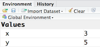{ width="400" }
</figure>

Now we can reference these buckets by name to perform mathematical operations on the values contained within. What do you get in the console for the following operation: 

```r
x + y
```

Try assigning the results of this operation to another variable called `number`. 

```r
number <- x + y
```

!!! example "Class Exercise" 

    1. Try changing the value of the variable `x` to 5. What happens to `number`?

    2. Now try changing the value of variable `y` to contain the value 10. What do you need to do, to update the variable `number`?

# Data Types

Variables can contain values of specific types within R. The six **data types** that R uses include: 

* `"numeric"` for any numerical value, including whole numbers and decimals. This is the most common data type for performing mathematical operations.

* `"character"` for text values, denoted by using quotes ("") around value. For instance, while 5 is a numeric value, if you were to put quotation marks around it, it would turn into a character value, and you could no longer use it for mathematical operations. Single or double quotes both work, as long as the same type is used at the beginning and end of the character value.

* `"integer"` for whole numbers (e.g., `2L`, the `L` indicates to R that it's an integer). It behaves similar to the `numeric` data type for most tasks or functions; however, it takes up less storage space than numeric data, so often tools will output integers if the data is known to be comprised of whole numbers. Just know that integers behave similarly to numeric values. If you wanted to create your own, you could do so by providing the whole number, followed by an upper-case L.

* `"logical"` for `TRUE` and `FALSE` (the Boolean data type). The `logical` data type can be specified using four values, `TRUE` in all capital letters, `FALSE` in all capital letters, a single capital `T` or a single capital `F`.

* `"complex"` to represent complex numbers with real and imaginary parts (e.g.,
  `1+4i`) and that's all we're going to say about them

* `"raw"` that we won't discuss further

The table below provides examples of each of the commonly used data types:

| Data Type  | Examples|
| -----------:|:-------------------------------:|
| Numeric:  | 1, 1.5, 20, pi|
| Character:  | “anytext”, “5”, “TRUE”|
| Logical:  | TRUE, FALSE, T, F|

The type of data will determine what you can do with it. For example, if you want to perform mathematical operations, then your data type cannot be character or logical. Whereas if you want to search for a word or pattern in your data, then you data should be of the character data type. The task or function being performed on the data will determine what type of data can be used. 


# Data Structures

We know that variables are like buckets, and so far we have seen that bucket filled with a single value. Even when `number` was created, the result of the mathematical operation was a single value. **Variables can store more than just a single value, they can store a multitude of different data structures.** These include, but are not limited to, vectors (`c`), factors (`factor`), matrices (`matrix`), data frames (`data.frame`) and lists (`list`).


## Vectors

A vector is the most common and basic data structure in R, and is pretty much the workhorse of R. It's basically just a collection of values, mainly either numbers,

<figure markdown="span">
  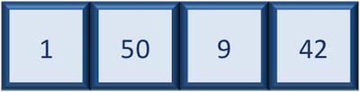{ width="400" }
</figure>

or characters,

<figure markdown="span">
  { width="400" }
</figure>

or logical values,

<figure markdown="span">
  { width="400" }
</figure>

**Note that all values in a vector must be of the same data type.** If you try to create a vector with more than a single data type, R will try to coerce it into a single data type. 

For example, if you were to try to create the following vector:

<figure markdown="span">
  { width="400" }
</figure>

R will coerce it into:

<figure markdown="span">
  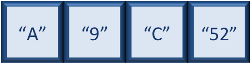{ width="400" }
</figure>

The analogy for a vector is that your bucket now has different compartments; these compartments in a vector are called *elements*. 

Each **element** contains a single value, and there is no limit to how many elements you can have. A vector is assigned to a single variable, because regardless of how many elements it contains, in the end it is still a single entity (bucket). 

Let's create a vector of genome lengths and assign it to a variable called `glengths`. 

Each element of this vector contains a single numeric value, and three values will be combined together into a vector using `c()` (the combine function). All of the values are put within the parentheses and separated with a comma.

```r
# Create a numeric vector and store the vector as a variable called 'glengths'
glengths <- c(4.6, 3000, 50000)
glengths
```

*Note your environment shows the `glengths` variable is numeric (num) and tells you the `glengths` vector starts at element 1 and ends at element 3 (i.e. your vector contains 3 values) as denoted by the [1:3].*


A vector can also contain characters. Create another vector called `species` with three elements, where each element corresponds with the genome sizes vector (in Mb).

```r
# Create a character vector and store the vector as a variable called 'species'
species <- c("ecoli", "human", "corn")
species
```

What do you think would happen if we forgot to put quotations around one of the values? Let's test it out with corn.

```r
# Forget to put quotes around corn
species <- c("ecoli", "human", corn)
```

Note that RStudio is quite helpful in color-coding the various data types. We can see that our numeric values are blue, the character values are green, and if we forget to surround corn with quotes, it's black. What does this mean? Let's try to run this code.

When we try to run this code we get an error specifying that object 'corn' is not found. What this means is that R is looking for an object or variable in my Environment called 'corn', and when it doesn't find it, it returns an error. If we had a character vector called 'corn' in our Environment, then it would combine the contents of the 'corn' vector with the values "ecoli" and "human".

Since we only want to add the value "corn" to our vector, we need to re-run the code with the quotation marks surrounding corn. A quick way to add quotes to both ends of a word in RStudio is to highlight the word, then press the quote key.

```r
# Create a character vector and store the vector as a variable called 'species'
species <- c("ecoli", "human", "corn")
```

!!! example "Class Exercise" 

    Create a vector of numeric and character values by _combining_ the two vectors that we just created (`glengths` and `species`). Assign this combined vector to a new variable called `combined`. *Hint: you will need to use the combine `c()` function to do this*. 
  
    Print the `combined` vector in the console, what looks different compared to the original vectors?


### Tips on variable names

Variables can be given almost any name, such as `x`, `current_temperature`, or
`subject_id`. However, there are some rules / suggestions you should keep in mind:

- Make your names explicit and not too long.
- Avoid names starting with a number (`2x` is not valid but `x2` is)
- Avoid names of fundamental functions in R (e.g., `if`, `else`, `for`, see [here](https://statisticsglobe.com/r-functions-list/) for a complete list). 
- Avoid dots (`.`) within a variable name as in `my.dataset`. There are many functions
in R with dots in their names for historical reasons, but because dots have a
special meaning in R (for methods) and other programming languages, it's best to
avoid them. 
- Use nouns for object names and verbs for function names
- Keep in mind that **R is case sensitive** (e.g., `genome_length` is different from `Genome_length`)
- Be consistent with the styling of your code (where you put spaces, how you name variable, etc.). In R, two popular style guides are [Hadley Wickham's style guide](http://adv-r.had.co.nz/Style.html) and [Google's](http://web.stanford.edu/class/cs109l/unrestricted/resources/google-style.html).

***

### Best practices

Before we move on to more complex concepts and getting familiar with the language, we want to point out a few things about best practices when working with R which will help you stay organized in the long run:

* Code and workflow are more reproducible if you can document everything that we do. Your end goal is not just to "do stuff", but to do it in a way that anyone can easily and exactly replicate your workflow and results. **All code should be written in the script editor and saved to file, rather than working in the console.** 
* The **R console** should be mainly used to inspect objects, test a function or get help. 
* Use `#` signs to comment. **Comment liberally** in your R scripts. This will help future you and other collaborators know what each line of code (or code block) was meant to do. Anything to the right of a `#` is ignored by R. 


## Summary of Commands 

```{r}
# commands 
# getwd() - get working directory
# setwd() - set working directory 
```

***

### Citation

To cite material from this course in your publications, please use:

Some materials used in these lessons were derived from work that is Copyright © Data Carpentry (http://datacarpentry.org/). 
All Data Carpentry instructional material is made available under the [Creative Commons Attribution license](https://creativecommons.org/licenses/by/4.0/) (CC BY 4.0).

Other materials were derived from Babraham Bioinformatics - Training Courses. (n.d.). https://www.bioinformatics.babraham.ac.uk/training.html  

NIH Bioinformatics Training and Education Program. "Introductory R for Novices". Last updated January 2026. https://bioinformatics.ccr.cancer.gov/docs/r_for_novices/

---


