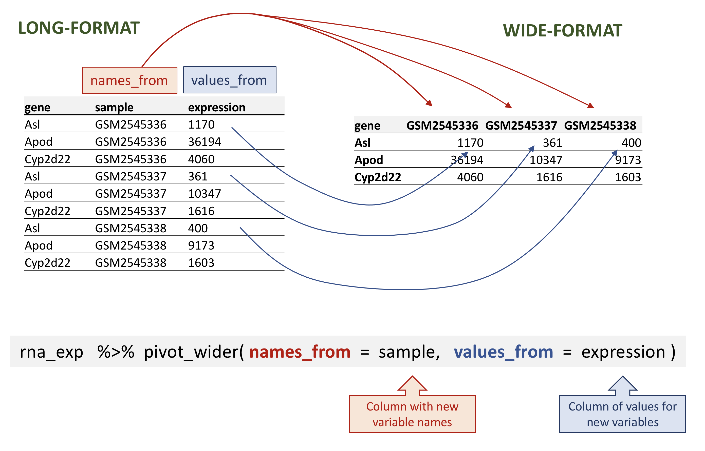

## Lesson 8: Reshaping data with `tidyr`

## Learning Objectives

+ Describe the concept of a wide and a long table format, and see how to reshape a data frame from one format to the other one.

+ Demonstrate how to join tables.

***


# Data manipulation with `dplyr` and `tidyr`

The package `dplyr` provides powerful tools for data manipulation tasks. It is built to work directly with data frames, with many manipulation tasks optimized.

Sometimes we want a data frame to be reshaped to be able to do some specific analyses or for visualization. The package `tidyr` addresses this common problem of reshaping data and provides tools for manipulating data in a tidy way.

The `tidyverse` package is an “umbrella-package” that installs several useful packages for data analysis which work well together, such as `tidyr`, `dplyr`, `ggplot2`, `tibble`, etc. These packages help us to work and interact with the data. They allow us to do many things with your data, such as subsetting, transforming, visualising, etc.

## `dplyr` Review 

We learned some of the most ocmmon `dplyr` functions:

  + `select()`: subset columns
  + `filter()`: subset rows on conditions
  + `mutate()`: create new columns by using information from other columns
  + `group_by()` and `summarise()`: create summary statistics on grouped data
  + `arrange()`: sort results
  + `count()`: count discrete values


# Reshaping data 

**What do we mean by reshaping data?**

Data reshaping is one aspect of tidying our data. The shape of our data is determined by how values are organized across rows and columns. When reshaping data we are most often wrangling the data from wide to long format or vice versa. 

In the `rna` tibble, the rows contain expression values (the unit) that are associated with a combination of 2 other variables: `gene` and `sample`.

```r
rna |> 
  arrange(gene)
```

All the other columns correspond to variables describing either the sample (organism, age, sex, …) or the gene (gene_biotype, ENTREZ_ID, product, …). The variables that don’t change with genes or with samples will have the same value in all the rows.

This structure is called a `long-format`, as one column contains all the values, and other column(s) list(s) the context of the value.

In certain cases, the `long-format` is not really “human-readable”, and another format, a `wide-format` is preferred, as a more compact way of representing the data. 

In this format, it would become straightforward to explore the relationship between the gene expression levels within, and between, the samples.

To convert the gene expression values from `rna` into a wide-format, we need to create a new table where the values of the `sample` column would become the names of column variables.

We can do both these of transformations using two `tidyr` functions:

`pivot_wider()` - Makes a long data set wide.

`pivot_longer()` - Makes a wide data set long. 

## Pivoting the data into a wider format 

!!! example "Class Exercise" 

    Select the first 3 columns of `rna`. Redirect the output to `rna_exp`. 


<figure markdown="span">
  { width="600" }
</figure>


***

### Citation

To cite material from this course in your publications, please use:

Some materials used in these lessons were derived from work that is Copyright © Data Carpentry (http://datacarpentry.org/). 
All Data Carpentry instructional material is made available under the [Creative Commons Attribution license](https://creativecommons.org/licenses/by/4.0/) (CC BY 4.0).

Other materials were derived from Babraham Bioinformatics - Training Courses. (n.d.). https://www.bioinformatics.babraham.ac.uk/training.html  

NIH Bioinformatics Training and Education Program. "Introductory R for Novices". Last updated January 2026. https://bioinformatics.ccr.cancer.gov/docs/r_for_novices/

---


