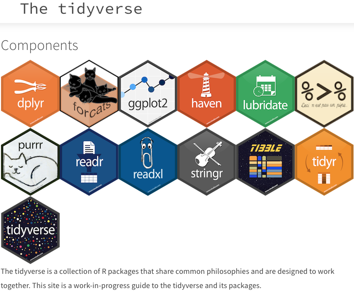

## Week 6

# Introduction to `ggplot2`

## Why visualize your data?

Data visualization is an important part of scientific data analysis. A well-designed plot can help you quickly identify patterns, differences, relationships, and unusual observations that may be difficult to see in a table of numbers.

In this lesson, we will learn how to use **`ggplot2`** to turn data into informative visualizations. Rather than memorizing individual plotting functions, we will learn a general approach that you can use to build many different types of scientific figures.

By the end of the week, you should be able to take a dataset, identify the variables you want to explore, and construct a plot that communicates a biological question or finding.

## The Tidyverse

The **Tidyverse** is a collection of R packages designed to work together for common data science tasks. These packages provide tools for importing, tidying, transforming, analyzing, and visualizing data.

You have already encountered some Tidyverse packages and functions for working with data. This week, we will focus on one of the Tidyverse's most widely used packages for data visualization: **`ggplot2`**.

<figure markdown="span">
  { width="600" }
</figure>


## What is `ggplot2`?

`ggplot2` is a Tidyverse package for creating data visualizations. It is based on the idea that a plot can be built by combining several components:

* **Data** — the dataset you want to visualize
* **Aesthetic mappings** — which variables should control visual properties such as position, color, or shape
* **Geometries** — the type of visual representation you want to use, such as points, bars, or lines
* **Scales and labels** — how variables and visual elements are displayed
* **Themes** — how the overall appearance of the plot is formatted

This approach allows you to start with a simple plot and gradually add information to make it more useful and informative.

We will begin with simple plots and build toward visualizations that allow us to ask and answer biological questions.

### Loading `ggplot2`

Because `ggplot2` is part of the Tidyverse, loading `tidyverse` makes `ggplot2` and the other Tidyverse packages available.

```{r}
library(tidyverse)
```

---

## About the dataset: Palmer Penguins

To learn `ggplot2`, we will work with the **Palmer Penguins** dataset.

The dataset contains measurements from **344 penguins** living on three islands in the Palmer Archipelago of Antarctica: Torgersen, Biscoe, and Dream. The penguins belong to three species:

* Adelie
* Chinstrap
* Gentoo

For each penguin, the dataset contains information about its species, island, sex, and several physical measurements, including:

* bill length
* bill depth
* flipper length
* body mass

These variables give us many opportunities to ask biological questions using data visualization.

---

## What should you be able to do by the end of this week?

By the end of this week, you should be able to:

1. **Explain the purpose of data visualization** and describe how plots can help you explore and communicate scientific data.

2. **Describe the basic structure of a `ggplot2` visualization**, including the roles of data, aesthetic mappings, and geometries.

3. **Create basic plots** using `ggplot2`, including scatterplots, boxplots, bar plots, and histograms.

4. **Map variables to visual properties** such as position, color, shape, and size.

5. **Customize your plots** by adding labels, titles, legends, and themes.

6. **Use plots to explore biological questions**, rather than simply creating figures because a particular plot type was requested.

7. **Interpret a visualization** and describe the biological pattern or relationship it shows.

8. **Choose an appropriate visualization** based on the types of variables and the scientific question you are investigating.

The goal is not simply to learn how to make prettier graphs. **The goal is to use visualization as a tool for thinking about your data.**

